## estree

* <a href="#NewExpression">NewExpression</a>

* <a href="#BinaryExpression">BinaryExpression</a>

* <a href="#MemberExpression">MemberExpression</a>

* <a href="#ConditionalExpression">ConditionalExpression</a>

* <a href="#LogicalExpression">LogicalExpression</a>

* <a href="#ArrayExpression">ArrayExpression</a>

* <a href="#ObjectExpression">ObjectExpression</a>

* <a href="#ArrowFunctionExpression">ArrowFunctionExpression</a>

* <a href="#VariableDeclarator">VariableDeclarator</a>

* <a href="#AssignmentExpression">AssignmentExpression</a>

* <a href="#FunctionDeclaration">FunctionDeclaration</a>

* <a href="#CallExpression">CallExpression</a>

* <a href="#ReturnStatement">ReturnStatement</a>

#### NewExpression

* `new a(1)`

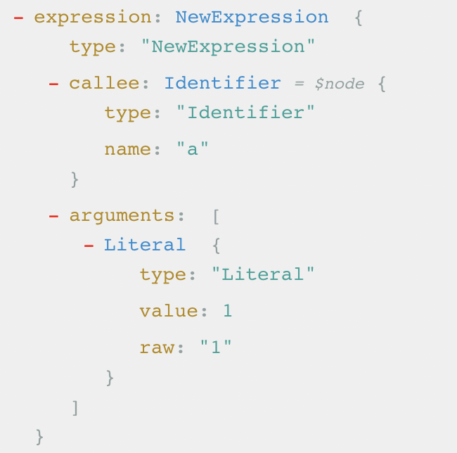

#### BinaryExpression

* `a === b`

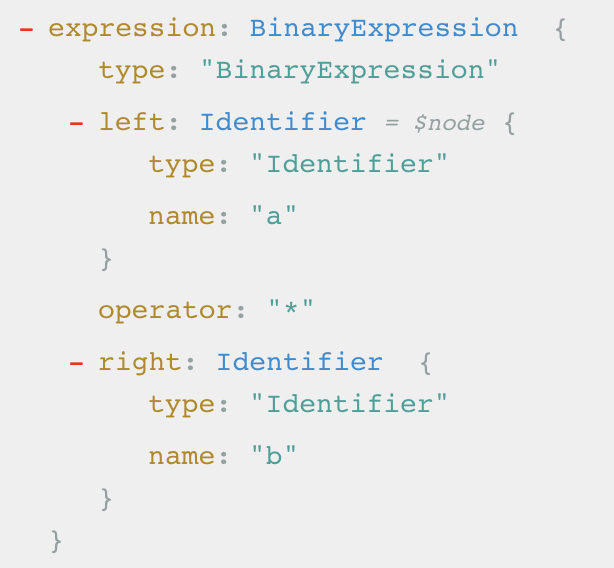

* `1 + 2`

#### MemberExpression

* `a.b`

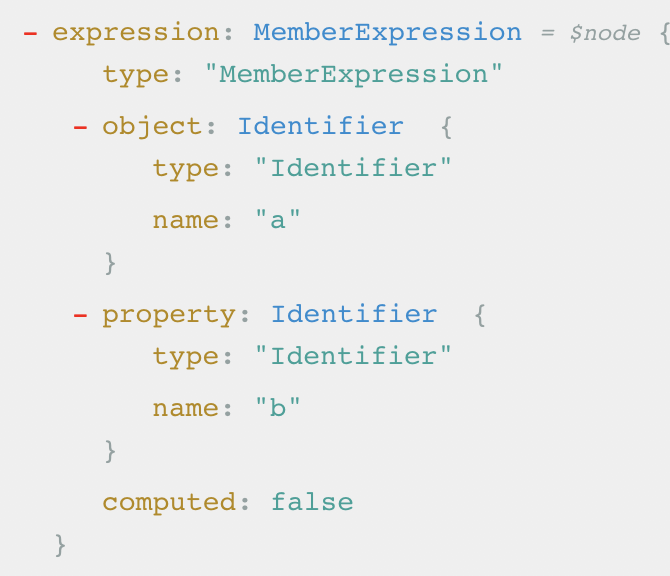

#### ConditionalExpression

* `a ? b : c`

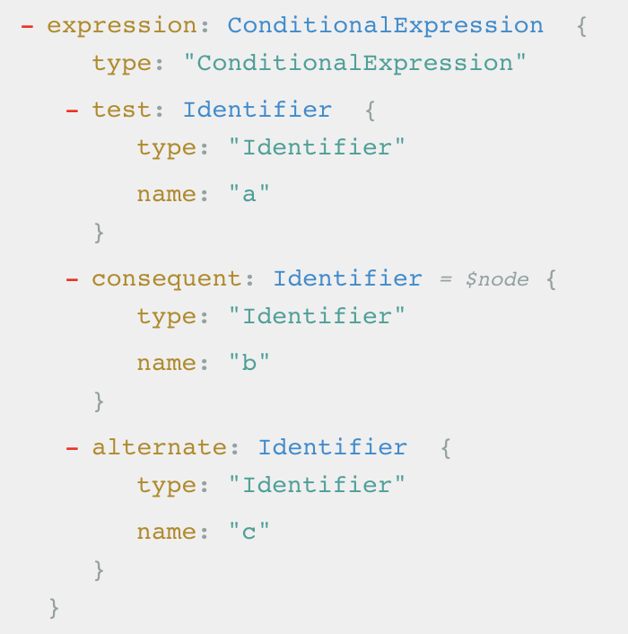

#### ArrayExpression

* `[a, 1]`

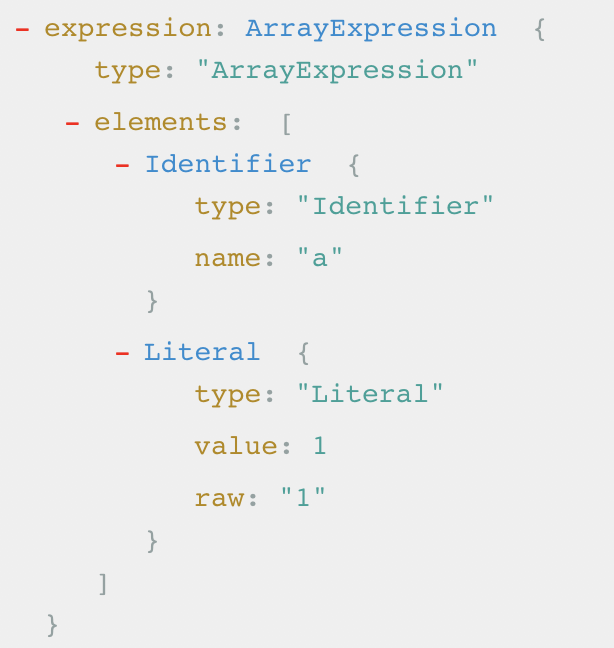

#### ObjectExpression

* `c = { a: 1, b: 2}`

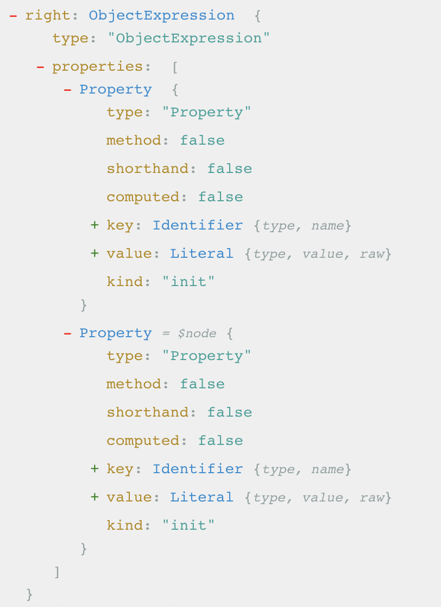

#### LogicalExpression

* `a && b`  (`a || b`)

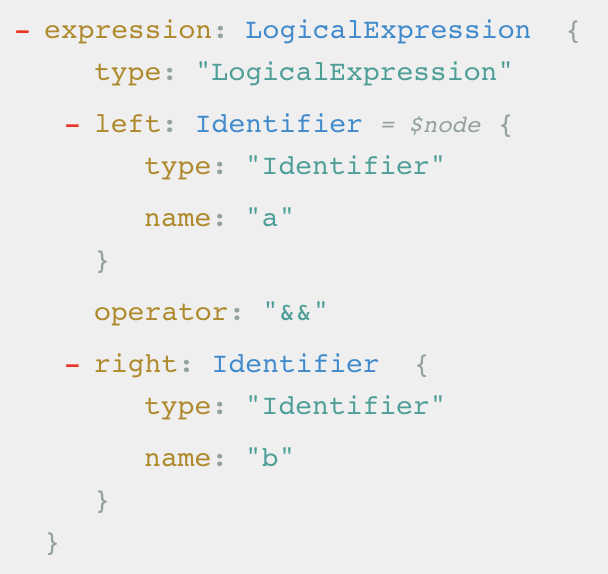

#### ArrowFunctionExpression

* `(a, b) => {}`

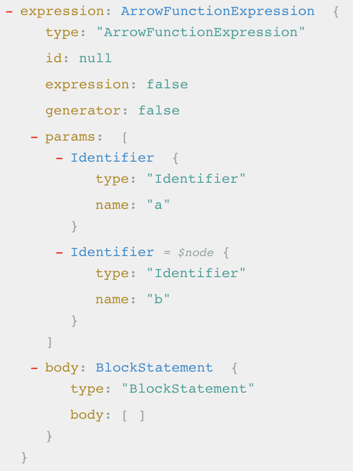

#### VariableDeclarator

* `let b = a`

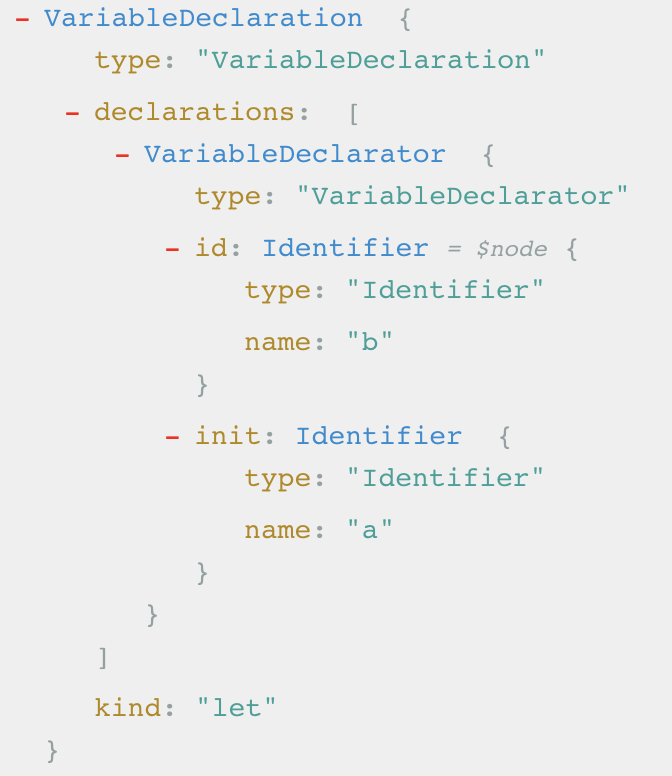

#### AssignmentExpression

* `a = 1`

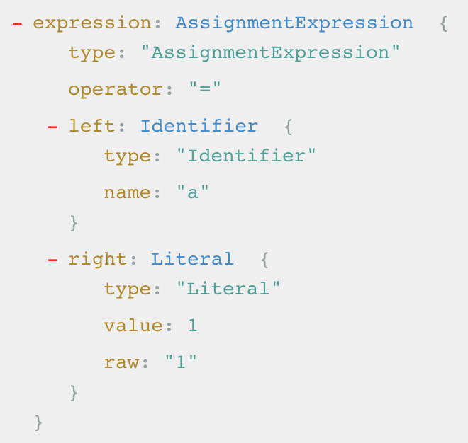

#### FunctionDeclaration

* `function f (a, b) {}`

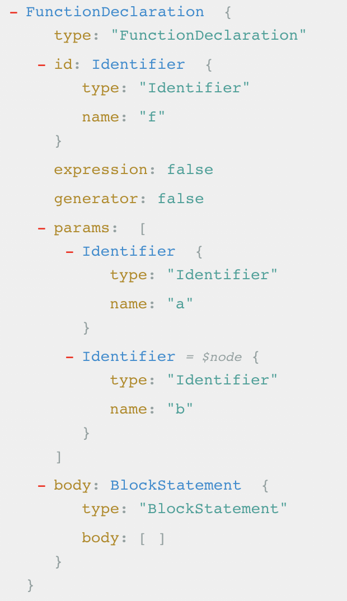

#### CallExpression

* `f(a, b)`

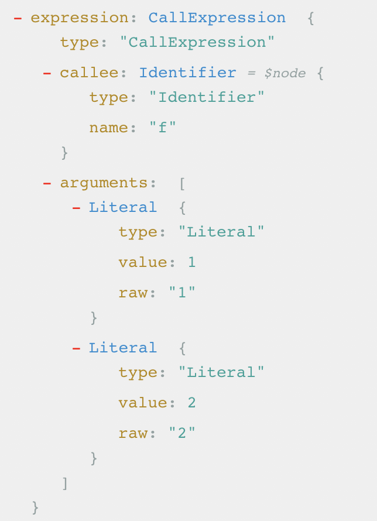

#### ReturnStatement

* `return a`

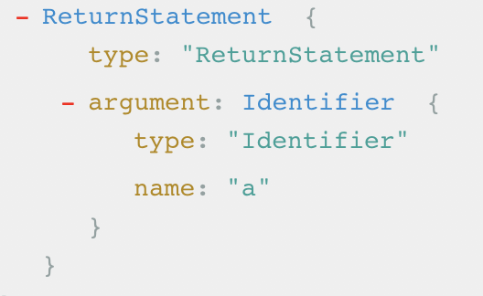
