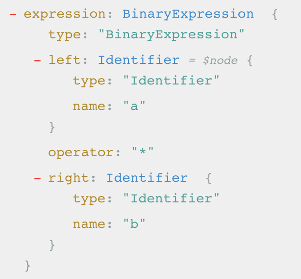
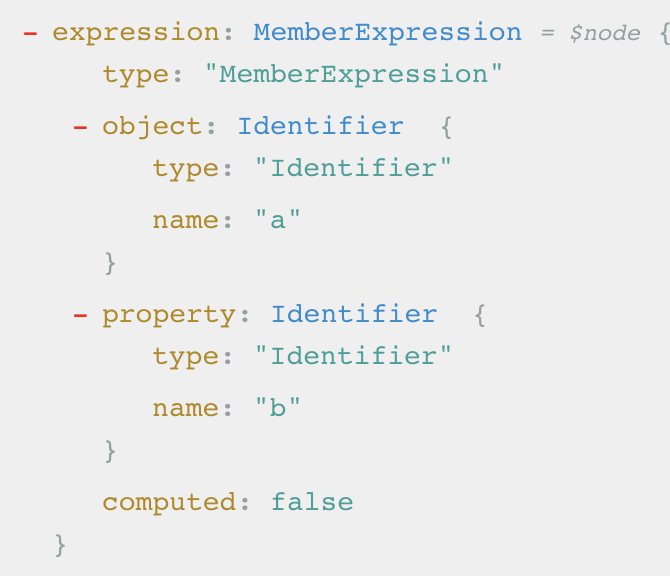

## estree

<a href="#BinaryExpression">BinaryExpression</a>
<a href="#MemberExpression">MemberExpression</a>
<a href="#ConditionalExpression">ConditionalExpression</a>
<a href="#LogicalExpression">LogicalExpression</a>
<a href="#LogicalExpression">ArrowFunctionExpression</a>
<a href="#LogicalExpression">FunctionDeclaration</a>
<a href="#LogicalExpression">CallExpression</a>

#### BinaryExpression

* `a === b`
  

* `1 + 2`

#### MemberExpression

* `a.b`
  

#### ConditionalExpression

* `a ? b : c`
  

#### LogicalExpression

* `a && b`  (`a || b`)
  

#### ArrowFunctionExpression

* `(a, b) => {}`
  

#### FunctionDeclaration

* `function f (a, b) {}`
  

#### CallExpression

* `f(a, b)`
  
